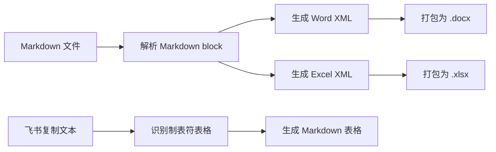

# 项目架构文档

最后更新于：2026-05-09

## 项目概述

本工作区主要用于维护 JQ Tools 压力感知系统的产品文档、竞品分析、用户故事、测试用例和研发交付 PRD。当前维护了本地命令行工具，用于在 Markdown、Word、Excel 和飞书粘贴文本之间做轻量转换，方便人工编辑和团队流转。

## 目录结构

```text
D:\pm-skill
├── *.md
├── shroom\
│   └── FUNCTION_IMPLEMENTATION.md
├── 机器人\
│   └── 机器人相关调研文档
└── tools\
    ├── md_office_converter.py
    ├── feishu_to_md.py
    └── README.md
```

## 技术栈

| 模块 | 技术 | 说明 |
|---|---|---|
| 文档源文件 | Markdown | PRD、需求分析、竞品分析、测试用例 |
| 转换工具 | Python 3 标准库 | 不依赖 pip 包 |
| Word 输出 | OOXML `.docx` | 通过 zip + XML 生成 |
| Excel 输出 | OOXML `.xlsx` | 通过 zip + XML 生成 |
| 飞书转 Markdown | Python 3 标准库 | 将飞书复制出的制表符表格转回 Markdown 表格 |

## 核心模块

### Markdown Office Converter

文件：`tools/md_office_converter.py`

职责：

1. 读取 Markdown 文件。
2. 解析标题、段落、列表、代码块和 Markdown 表格。
3. 输出 Word `.docx`。
4. 输出 Excel `.xlsx`。
5. Excel 中自动生成 `Outline` sheet，并把 Markdown 表格拆成独立 sheet。

命令示例：

```powershell
python tools\md_office_converter.py PRD-JQ-Tools-V2-Implementation-Aligned.md --to both --out converted
```

### Feishu To Markdown

文件：`tools/feishu_to_md.py`

职责：

1. 读取从飞书复制后保存的 `.txt` 文本。
2. 识别连续的制表符分隔行。
3. 转换成标准 Markdown 表格。
4. 尽量把 `1. 标题`、`1.1 标题` 还原成 Markdown 标题。

命令示例：

```powershell
python tools\feishu_to_md.py shroom\飞书粘贴内容.txt --out shroom\飞书转回Markdown.md
```

## 数据流



## 更新日志

| 日期 | 变更类型 | 说明 |
|---|---|---|
| 2026-05-09 | 新增功能 | 新增 Markdown 转 Word/Excel 命令行脚本。 |
| 2026-05-09 | 新增功能 | 新增飞书复制文本转 Markdown 命令行脚本。 |

## 项目进度

| 日期 | 完成内容 | 说明 |
|---|---|---|
| 2026-05-09 | Markdown Office Converter | 支持把 Markdown 转成 `.docx` 和 `.xlsx`，并完成 PRD 文档转换测试。 |
| 2026-05-09 | Feishu To Markdown | 支持把飞书复制出的制表符表格转成 Markdown 表格，解决飞书粘贴回 `.md` 后结构失效的问题。 |
