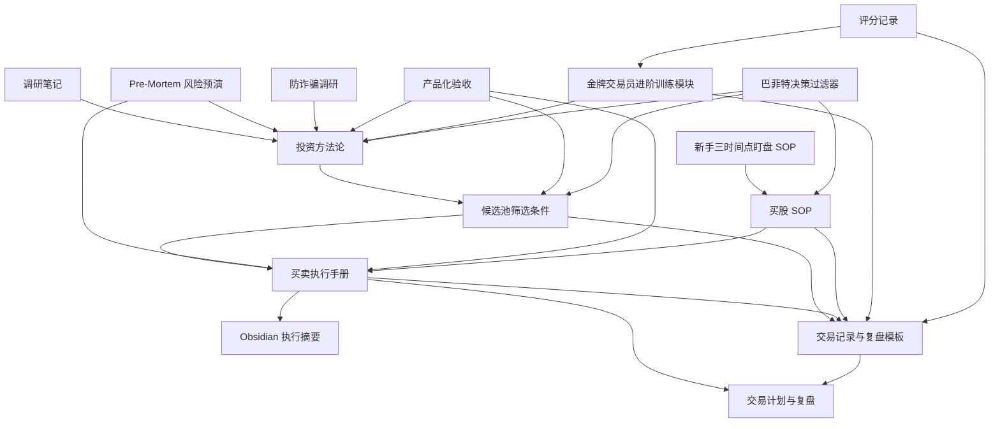

# 架构文档

> 本文档由 Codex 自动生成和维护。最后更新于：2026-06-25 09:04

## 1. 项目概述

本项目是一个股票交易方法论与执行纪律文档库，用于沉淀面向 A 股个人投资者的交易框架。内容覆盖投资原则、候选股筛选、买卖执行、风险预演、防诈骗调研和 Obsidian 笔记摘要。

项目目标不是提供确定收益或个股荐股，而是把选股、买点、仓位、止损、止盈、复盘和风险控制写成可执行、可检查、可复盘的规则。

## 2. 技术栈

| 分类 | 技术 | 版本/说明 |
| :--- | :--- | :--- |
| 前端框架 | 无 | 当前为 Markdown 文档库 |
| 后端框架 | 无 | 无 API 服务 |
| 数据库 | 无 | 无持久化数据库 |
| 编程语言 | Markdown | 文档和模板为主 |
| 包管理器 | 无 | 未发现依赖管理文件 |
| 部署环境 | 本地文件系统 | 适合 Obsidian、编辑器或 Git 管理 |
| 其他关键库 | 无 | 当前没有外部代码依赖 |

## 3. 目录结构

```text
E:\product\gu
|-- ARCHITECTURE.md
|-- PreMortem-股票买卖执行-2026-06-24.md
|-- 炒股必胜调研-2026-06-24.md
|-- 股票买卖执行-Obsidian笔记-2026-06-24.md
|-- 股票买卖执行手册-2026-06-24.md
|-- 股票候选池筛选条件-2026-06-24.md
|-- 股票投资方法论-2026-06-24.md
`-- 股票投资方法论调研笔记-2026-06-24.md
```

### 关键文件说明

| 文件 | 主要功能 |
| :--- | :--- |
| `股票投资方法论-2026-06-24.md` | 总体投资框架，定义市场环境、股票池、估值、买入、卖出、仓位和复盘原则 |
| `股票候选池筛选条件-2026-06-24.md` | 候选股准入、量化评分、候选类型、价格来源、波动率仓位联动和明日计划模板 |
| `股票买卖执行手册-2026-06-24.md` | 买卖动作手册，包含盘前核查、巴菲特标签复核、仓位公式、下单规则、止损止盈和新手禁用规则 |
| `PreMortem-股票买卖执行-2026-06-24.md` | 交易执行失败预演，记录高风险行为、隐性担忧和阻断措施 |
| `股票投资方法论调研笔记-2026-06-24.md` | 方法论调研来源、核心判断和规则摘要 |
| `股票买卖执行-Obsidian笔记-2026-06-24.md` | 适合 Obsidian 使用的执行规则摘要 |
| `炒股必胜调研-2026-06-24.md` | 防范“必胜荐股”和非法荐股骗局的风险教育文档 |
| `交易系统产品化验收-2026-06-24.md` | 使用 PM skills 输出用户画像、验收测试和策略红队，验证新手是否能正确执行交易系统 |
| `交易记录与复盘模板-2026-06-24.md` | 承接候选评分、巴菲特过滤器标签、明日计划、交易日志、20 笔复盘、组合风险和连续亏损降仓记录 |
| `买股SOP-2026-06-24.md` | 固化每日买股流程，覆盖前一晚计划、盘前风控、9 点条件单、T+1 风险单和次日风险处理 |
| `新手三时间点盯盘SOP-豫光金铅-2026-06-25.md` | 面向新手的豫光金铅持仓盯盘 SOP，细化 09:15、09:35、14:30 三个时间点的判断和动作 |
| `金牌交易员进阶训练模块-2026-06-25.md` | 补充市场情绪周期、涨停/炸板案例库、量价关系训练、交易行为评分和进阶训练计划 |
| `巴菲特决策过滤器-2026-06-25.md` | 将巴菲特式能力圈、生意质量、安全边际、治理风险、耐心和仓位谦逊度转化为候选股上层过滤器 |
| `评分记录/` | 存放每日交易行为评分、复盘结论和次日改进项 |

## 4. 核心模块与数据流

### 4.1. 模块关系图



### 4.2. 主要数据流

1. 调研材料先沉淀为投资方法论，明确市场过滤、股票池、估值、仓位和复盘原则。
2. 投资方法论向候选池筛选条件下沉，形成硬性准入、评分表、候选类型和明日交易计划模板。
3. 候选股进入执行手册后，必须经过盘前核查、买入触发、仓位计算、止损止盈和新手禁用规则。
4. 每次交易后进入复盘系统，统计胜率、盈亏比、止损执行率、计划内交易占比和违纪行为。
5. Pre-Mortem 和防诈骗调研作为风险约束，持续修正方法论和执行手册。
6. 产品化验收从用户画像、测试场景和策略红队角度检查文档是否能被新手正确执行。
7. 交易记录与复盘模板把候选评分、交易计划和复盘指标落成可填写表格，用于真实样本验证。
8. 买股 SOP 把每日执行压缩为前一晚计划、盘前复核、开盘过滤、条件单设置和 T+1 风险处理。
9. 新手三时间点盯盘 SOP 把单票持仓管理拆成 09:15、09:35、14:30 三个可执行检查点。
10. 金牌交易员进阶训练模块用于沉淀市场情绪、涨停案例、量价案例和行为评分，帮助从规则执行升级到概率判断。
11. 评分记录目录保存每日行为评分和复盘结论，为后续 20 笔样本统计提供原始记录。
12. 巴菲特决策过滤器作为上层质量约束，先判断能力圈、生意质量、安全边际、治理风险和仓位纪律，再决定候选股能否进入投资级、交易级、观察级或禁入级。

## 5. API 端点

当前项目没有后端服务或 API 端点。

## 6. 外部依赖与集成

| 服务/库 | 用途 | 集成方式 |
| :--- | :--- | :--- |
| 交易所公告网站 | 核查公告、监管问询、减持和风险事件 | 人工查阅 |
| 行情数据网站 | 获取收盘价、成交额、均线、估值等数据 | 人工查阅或临时脚本辅助 |
| Obsidian | 笔记组织和双链引用 | Markdown 文件 |

## 7. 环境变量

当前项目没有环境变量。

## 8. 项目进度

> 记录项目从开始到现在已经完成的所有工作，每次新增追加到末尾。

| 完成时间 | 分支 | 完成的功能/工作 | 说明 |
| :--- | :--- | :--- | :--- |
| 2026-06-24 23:13 | main | 初始化交易文档库架构说明 | 创建项目架构文档，梳理调研、方法论、候选池、执行手册和风险预演的关系 |
| 2026-06-24 23:13 | main | 候选池筛选系统优化 | 补充量化评分、行业估值适配、价格来源、波动率仓位联动和明日计划模板 |
| 2026-06-24 23:13 | main | 买卖执行系统优化 | 补充盘前核查、下单前检查、目标价来源、波动率仓位修正和新手禁用规则 |
| 2026-06-24 23:13 | main | 投资方法论优化 | 补充系统合格标准、估值适配、交易计划字段和复盘有效性指标 |
| 2026-06-24 23:20 | main | 产品化验收文档 | 使用 PM skills 补充用户画像、验收测试场景和策略红队 |
| 2026-06-24 23:21 | main | 交易记录与复盘模板 | 新增数据源、候选评分、明日计划、交易日志、20 笔复盘、组合风险和连续亏损降仓模板 |
| 2026-06-24 23:32 | main | 买股 SOP | 新增每日买股流程，补充 T+1 下当天跌破止损后的风险处理 |
| 2026-06-25 00:26 | main | 新手盯盘 SOP | 新增豫光金铅一手持仓的三时间点详细操作说明 |
| 2026-06-25 00:36 | main | 进阶训练模块 | 新增市场情绪周期、涨停/炸板案例库、量价训练库和交易行为评分表 |
| 2026-06-25 00:40 | main | 评分记录 | 新增 2026-06-24 交易行为评分记录 |
| 2026-06-25 09:04 | main | 巴菲特决策过滤器 | 新增能力圈、生意质量、安全边际、治理风险、耐心和仓位谦逊度检查，并接入方法论、候选池、执行手册、复盘模板和买股 SOP |

## 9. 更新日志

| 时间 | 分支 | 变更类型 | 描述 |
| :--- | :--- | :--- | :--- |
| 2026-06-24 23:13 | main | 初始化 | 创建项目架构文档 |
| 2026-06-24 23:13 | main | 文档更新 | 将交易方法论文档升级为更可执行的候选筛选、买卖执行和复盘系统 |
| 2026-06-24 23:20 | main | 文档更新 | 安装并应用 phuryn/pm-skills，新增交易系统产品化验收文档 |
| 2026-06-24 23:21 | main | 文档更新 | 补齐专业化交易缺口，将真实记录和复盘模板纳入文档系统 |
| 2026-06-24 23:32 | main | 文档更新 | 新增买股 SOP，并在执行手册和复盘模板中接入 |
| 2026-06-25 00:26 | main | 文档更新 | 新增新手版三时间点盯盘 SOP，细化持仓观察、止盈、止损和条件单设置 |
| 2026-06-25 00:36 | main | 文档更新 | 补充金牌交易员进阶训练模块，将概率、节奏、案例和行为评分纳入系统 |
| 2026-06-25 00:40 | main | 文档更新 | 创建评分记录目录并写入首条交易行为评分 |
| 2026-06-25 09:04 | main | 文档更新 | 新增巴菲特决策过滤器，并将其作为候选池、执行手册、复盘模板和买股 SOP 的上层准入约束 |

---

*此文档旨在提供项目结构和文档关系快照，具体交易规则以各 Markdown 文档为准。*
